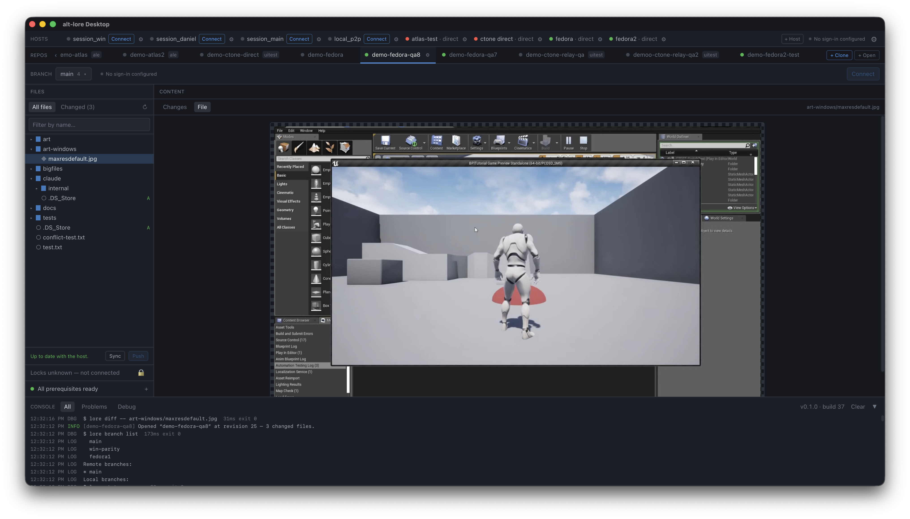

# alt-lore Desktop

A desktop app for working with [EpicGames Lore](https://epicgames.github.io/lore/) repositories,
wherever they live. A repository on your network is reached by address; one on someone else's
machine is reached over a peer-to-peer tunnel — no server to rent, no ports to forward, no VPN.

Built for artists and developers rather than operators. It is a front end for two programs it
bundles: the **`lore`** CLI, and the **[alt-p2p-lore](https://github.com/sync-different/alt-p2p-lore)**
tunnel it can use to carry it. You install one app; there is nothing else to set up.

<p align="center">
  
</p>

## What it does

- **Hosts** — reach a machine running loreserver either **peer-to-peer**, through an
  [alt-p2p](https://github.com/sync-different/alt-p2p) coordinator with no ports to forward, or
  **directly** at an address you can already reach. Past that choice everything works the same.
- **Workspaces** — one tab per working copy, showing at a glance whether you can work in it: is
  a host serving it, and is the identity it acts as signed in.
- **Sign-in** — paste the token your host issued you. Expiry is shown before it bites, and
  warned about an hour ahead, because tokens run out mid-task.
- **Two identities at once** — a workspace can be pinned to the user it acts as, so one machine
  can hold two clones of one repository as two different people.
- **Clone** — pick a repository by name from what your identity is granted, choose who it acts
  as, and watch a real progress bar.
- **Browse** — files, changes, diffs and locks for the open workspace.
- **Work** — stage and commit, sync and push, resolve merge conflicts, switch and create branches.
- **Console** — a feed across the bottom of what happened, colour-coded and in a fixed-width
  font. Switch on debug messages in Settings to see every `lore` command the app runs, how long
  it took and how it ended — which is what turns "it didn't work" into a report someone can act
  on. Keys and tokens are replaced with `***` before anything is shown.
- **Locks** — take one, give it back, and see who holds the rest. Breaking someone else's is a
  separate, deliberate action that names them: Lore itself applies no ownership check at all, so
  the only thing between a mis-click and a colleague's lost afternoon is that confirmation.
- **Hosts that come and go** — a host being switched off, asleep or restarted is an expected
  condition rather than an error. Direct hosts are checked rather than assumed, so a machine that
  is off never shows as fine; a host that comes back re-reads by itself; and a dropped tunnel is
  put back up. A push that failed while a host was away is raised when it could succeed — with a
  button, never re-sent behind your back.

## Install

Grab the installer for your platform from [Releases](../../releases) — or build one yourself,
below.

**macOS** (Apple Silicon) — open `alt-lore-desktop_<version>_aarch64.dmg` and drag the app to
Applications. The app is signed and notarized, so it opens without warnings.

**Windows** (10/11, x64) — run the `-setup.exe` installer. Builds are signed by
Alterante, Inc. — while the
certificate is new, SmartScreen may still show "unrecognized app"; choose **More info → Run
anyway**.

There is no Linux build yet. On either platform nothing else is required: `lore`, the tunnel
and a Java runtime are all inside the bundle.

Under **+ Host** you choose how to reach it.

**Peer-to-peer** — for a host on someone else's network. Three things from whoever runs it:

| | Example |
|---|---|
| Coordinator address | `coord.example.com:9000` |
| Session name and key | `lore-studio-main` + a shared secret |
| Identity port, if it requires signing in | `9443` — must match the host's exactly |

**Direct** — for a host you can already reach, including this machine:

| | Example |
|---|---|
| Repository address | `grpc://lore.example:41337` |
| Auth URL, if it requires signing in | `https://lore.example:9443` — blank if not |

Then **Connect** (peer-to-peer only — a direct host has nothing to connect) and **+ Clone**.

## Build

Requires Node 20+, Rust (stable) and a JDK 17+ (used once, to `jlink` the bundled runtime).
Windows additionally needs the MSVC toolchain and Git Bash, which runs the staging script
unchanged.

```bash
scripts/fetch-deps.sh        # stage the third-party payload — see below
npm install
npm run tauri build          # bundles for the host you are on
```

The result is `src-tauri/target/release/bundle/` — `app` and `dmg` on macOS, `msi` and `nsis`
on Windows. Targets are not listed in the config: `"targets": "all"` resolves per platform,
which is Tauri's own default.

Run `scripts/fetch-deps.sh` **before `cargo test`, not just before a build** — Tauri validates
the bundled payload in its build script, so an unstaged tree fails the tests too.

### The third-party payload

Four things ship inside the installer and **none of them are in git** — `lore` alone is 33 MB
and a runtime ~45 MB. `scripts/fetch-deps.sh` stages them and writes `deps-manifest.json`
recording the exact versions, so a build can be traced back to what went into it:

1. the `lore` CLI binary
2. `run-java`, the sidecar that launches the bundled runtime
3. alt-p2p-lore's fat JAR
4. a `jlink`'d Java runtime to run that JAR

The sidecar differs by platform and the script handles it: Unix ships `run-java.sh` as-is,
Windows compiles `src-tauri/scripts/run-java.rs` with `rustc` (already required, to read the
target triple), because a Windows sidecar must be a real executable and a renamed `.cmd` will
not load. Both are named `run-java`, so nothing calling it knows which platform it is on.

It copies from local paths, overridable when they move:

```bash
LORE_SRC=/path/to/lore \
JAR_SRC=/path/to/alt-p2p-lore-<version>.jar \
JDK_HOME=/path/to/jdk \
  scripts/fetch-deps.sh

scripts/fetch-deps.sh --check    # report what is staged; copy nothing
```

## Run in development

```bash
npm run tauri dev
```

`fetch-deps.sh` must have run first, or the app starts and every operation reports the bundled
programs missing — which the Prerequisites panel will tell you.

## Test

```bash
npm run test:all      # both suites
npm test              # vitest (frontend)
npm run test:rust     # cargo test
npm run build         # also typechecks
```

The `lore` CLI has no machine-readable output, so its text is parsed against golden fixtures
captured from the real thing (`src-tauri/tests/fixtures/`, regenerated by
`scripts/capture-fixtures.sh`). Most of the logic lives in pure functions under `src/lib/` and
`src-tauri/src/lore/` precisely so it can be tested without a host, a tunnel or a repository.

## Documentation

| | |
|---|---|
| [ARCHITECTURE.md](ARCHITECTURE.md) | how the app is put together, and why |
| [CLAUDE.md](CLAUDE.md) | working on the code: build, gotchas, status |

## License

AGPL-3.0 — see [LICENSE](LICENSE) for details.

The app bundles third-party programs under their own terms; see [licenses/](licenses/).
